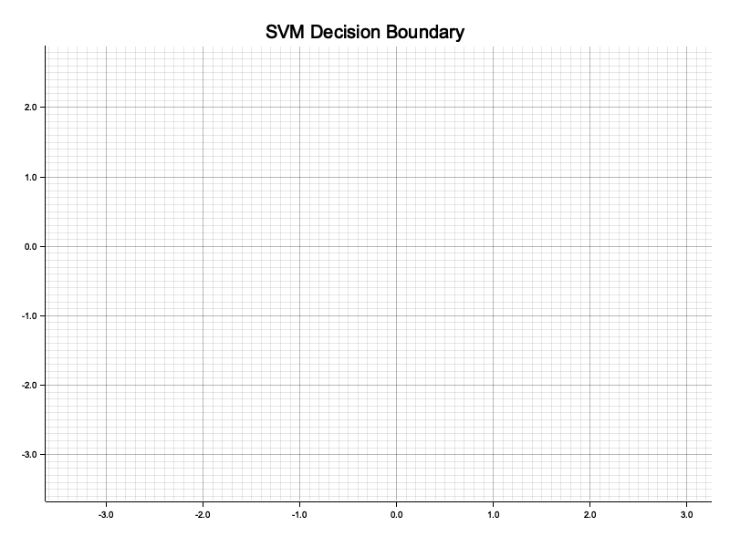
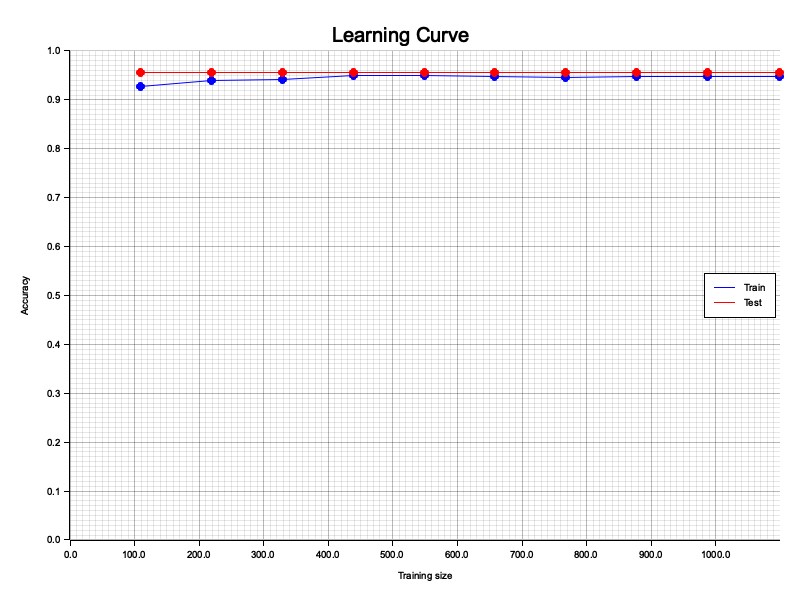
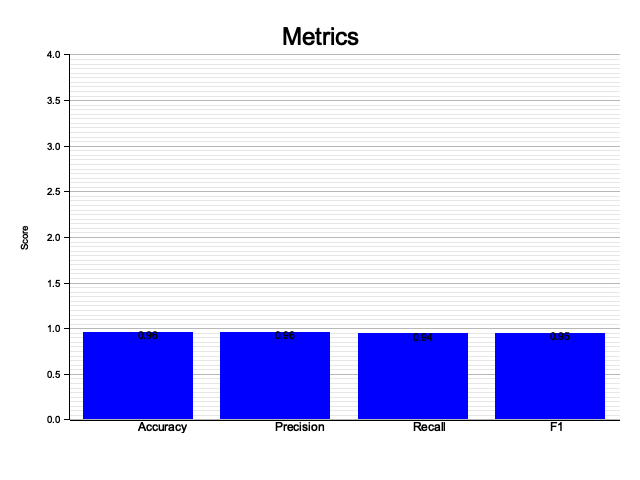
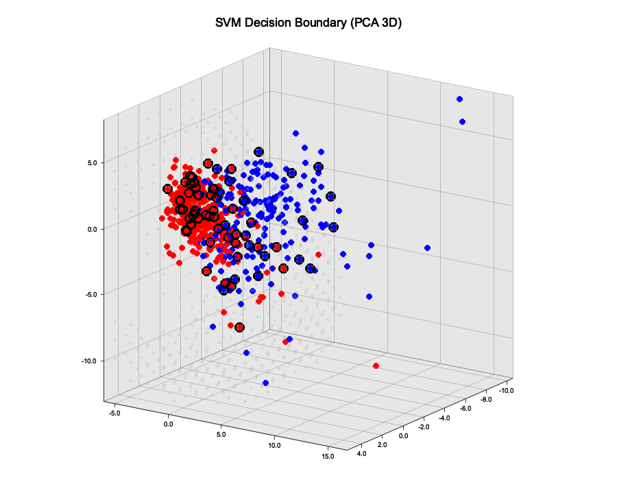
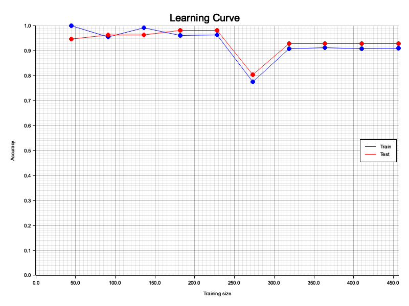
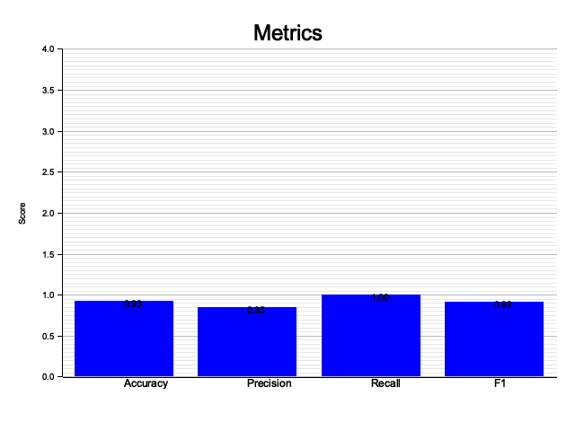

A Support Vector Machine implementation in Rust, built from scratch. It includes the SMO optimizer, kernel functions, cross-validation, grid search, PCA, and visualization utilities.

## Overview

This project implements a binary SVM classifier using the Sequential Minimal Optimization (SMO) algorithm. It supports linear and RBF kernels, hyperparameter tuning via grid search with k-fold cross-validation, and several plotting utilities for evaluating model performance.

## Project Structure

```
src/
  main.rs             Entry point; runs experiments on example datasets
  svm.rs              SVM struct: fit and predict
  optimizer.rs        SMO algorithm implementation
  kernel.rs           Kernel trait, Linear and RBF kernels
  hyperparameters.rs  Hyperparameter struct and defaults
  cross_val.rs        K-fold cross-validation
  grid_search.rs      Grid search over C and sigma
  evaluation.rs       Metrics: accuracy, precision, recall, F1
  data.rs             Data generation, CSV loading, train/test splitting, shuffling
  pca.rs              PCA via power iteration for dimensionality reduction
  plots.rs            Decision boundary, learning curve, metrics bar chart, grid search heatmap
```

## Features

**Kernels**

- Linear: dot product of input vectors
- RBF (Gaussian): controlled by the `sigma` parameter

**SMO Optimizer**
Implements the full SMO algorithm with:

- KKT condition checking
- Heuristic second alpha selection (maximize step size)
- Alpha clipping with L/H bounds
- Bias update after each alpha pair optimization
- Error cache for efficiency

**Hyperparameter Tuning**
Grid search over `C` and `sigma` values using k-fold cross-validation. The best configuration is selected by average cross-validation accuracy.

**Evaluation**
Computes accuracy, precision, recall, and F1 score from a confusion matrix (TP, TN, FP, FN).

**Visualization**

- Decision boundary plot (2D)
- Decision boundary plot (3D via PCA projection)
- Learning curve (train vs test accuracy as training size grows)
- Metrics bar chart
- Grid search heatmap

**Data Utilities**

- Synthetic blob generation (two linearly separable clusters)
- CSV loading (last column treated as label; `0` remapped to `-1`)
- Train/test splitting by percentage
- Reproducible shuffling via seeded RNG

## Usage

### Running the default experiments

```bash
cargo run --release
```

This runs two experiments defined in `main.rs`:

- `svm_on_kaggle_dataset_linear`: trains a linear SVM on `test_datasets/banknote_clean.csv`
- `svm_on_kaggle_dataset_rbf`: trains an RBF SVM on `test_datasets/breast_cancer_clean.csv`

Both experiments perform grid search tuning, evaluate on a held-out test set, and write plots to the `plots/` directory.

### Running tests

```bash
cargo test
```

Tests cover kernel correctness, SMO internals (error, eta, LH bounds, clipping, KKT, training), SVM fit and predict, and data generation and loading.

## Results

### Linear SVM on Banknote Dataset

#### Configuration

| Parameter             | Value                   |
| --------------------- | ----------------------- |
| Kernel                | Linear                  |
| Dataset               | `banknote_clean.csv`    |
| Validation            | k-fold cross-validation |
| Hyperparameter Search | Grid Search             |

#### Metrics

| Metric    | Value |
| --------- | ----- |
| Accuracy  | 0.96  |
| Precision | 0.96  |
| Recall    | 0.94  |
| F1 Score  | 0.95  |

#### Visualizations

##### Decision Boundary



##### Learning Curve



##### Metrics Bar Chart



### RBF SVM on Breast Cancer Dataset

#### Configuration

| Parameter             | Value                     |
| --------------------- | ------------------------- |
| Kernel                | RBF                       |
| Dataset               | `breast_cancer_clean.csv` |
| Validation            | k-fold cross-validation   |
| Hyperparameter Search | Grid Search               |

#### Metrics

| Metric    | Value |
| --------- | ----- |
| Accuracy  | 0.93  |
| Precision | 0.85  |
| Recall    | 1.00  |
| F1 Score  | 0.92  |

#### Visualizations

##### Decision Boundary



##### Learning Curve



##### Metrics Bar Chart



## Data Format

CSV files should have features in all columns except the last, which must be the label. Labels should be `1` or `-1` (or `0`, which is automatically remapped to `-1`).

```
feature1,feature2,...,featureN,label
1.2,3.4,...,0.9,1
-0.5,2.1,...,1.3,-1
```

Pass `true` as the second argument to `load_csv` if the file has a header row.

## Hyperparameters

| Parameter    | Description                                     | Default             |
| ------------ | ----------------------------------------------- | ------------------- |
| `C`          | Regularization parameter                        | `1.0`               |
| `sigma`      | RBF kernel bandwidth                            | `1.0`               |
| `kkt_tol`    | Tolerance for KKT condition violations          | `0.001`             |
| `alpha_tol`  | Minimum meaningful change in alpha              | `1e-5`              |
| `max_passes` | Max passes without alpha change before stopping | `max(100, sqrt(n))` |

## Dependencies

- `rand`: random number generation and seeded shuffling
- `plotters`: all visualization output

## Notes

- The SMO implementation is a mix of cs229 simplified algorithm and the original John Platt paper.
- PCA uses the power iteration method with deflation to extract principal components.
- The `plots.rs` module was written with AI assistance.
- Labels must be `+1` or `-1` internally; the CSV loader handles `0` to `-1` remapping automatically.

## References

Big help from these:

- SVM Maths and Logic: [ritvikmath Youtube Channel](https://www.youtube.com/@ritvikmath)
- SVM Visual Explanation: [Visually Explained Youtube Channel](https://www.youtube.com/@VisuallyExplained)
- [CS 229 Simplified SMO Algorithm](https://cs229.stanford.edu/materials/smo.pdf)
- [Implementing a PCA](https://sebastianraschka.com/Articles/2014_pca_step_by_step.html)
- [SMO by Victor Lavrenko](https://www.youtube.com/watch?v=I73oALP7iWA&list=PLUrpa2zEenh29fP-9tP3CWgFaqdhIXI7D&index=1&t=38s)
- [Rust Documentation](https://doc.rust-lang.org/book/)
